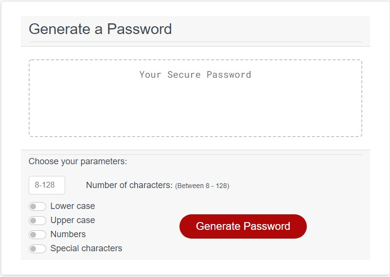
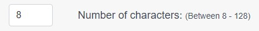
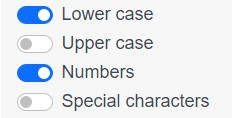
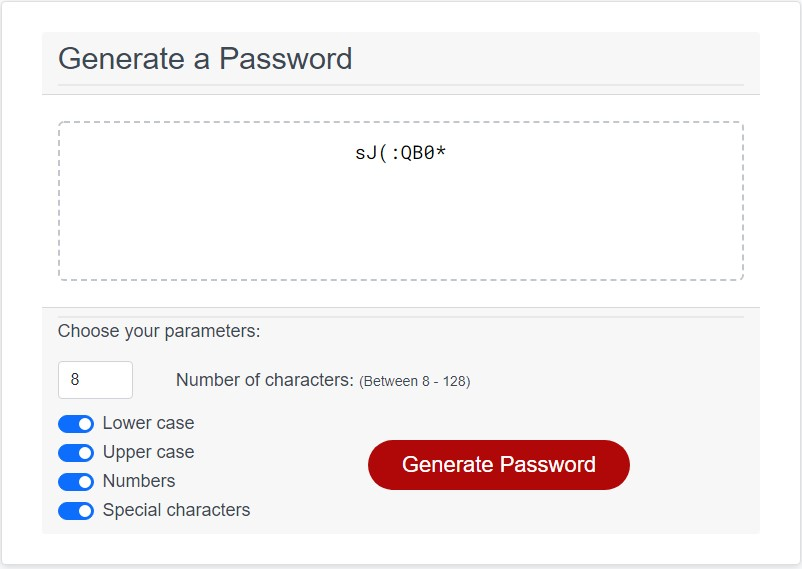
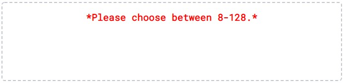
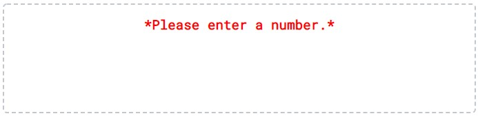
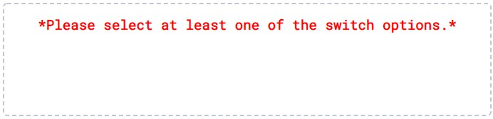

# Password Generator

# Description
A password generator that will generate a password based on user input

# Usage
Enter the number of characters that you would like in your password.

Confirm whether or not you would like lower case letters, upper case letters, numbers, and/or special characters, by selecting the switches.  Blue for selected.  If the switch is selected, there will be at least one character of that type in the generated password.

Click the red button to generate your password.  

# Error checking
If the user enters a number outside of the given range, they will see this error:

If the user enters anything that is not a number, they will get this error:

If the user doesn't choose any of the switches, they will get this error: 

# Result
Sample output:

# Links
Github link: https://github.com/TimMartin13/password_generator

Published link: https://timmartin13.github.io/password_generator/